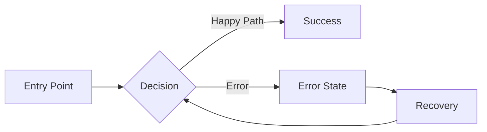
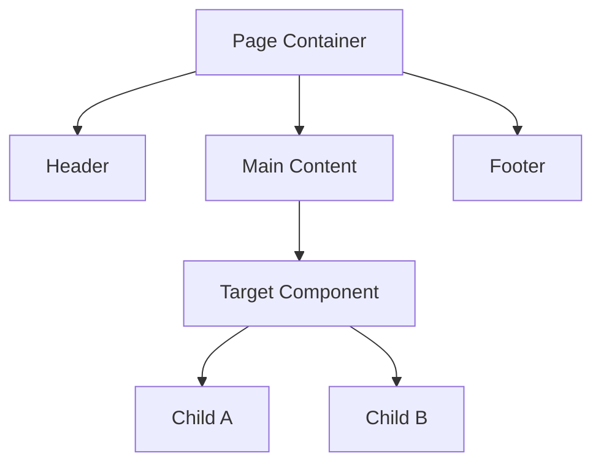
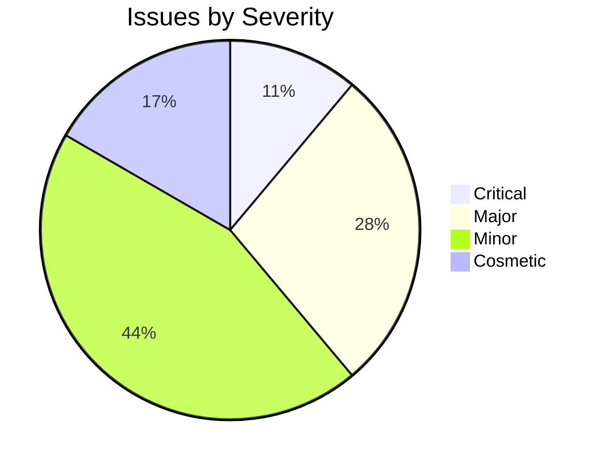
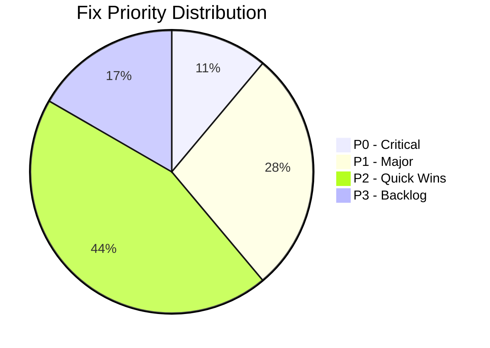
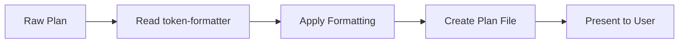

# UX Improve Command

**IMPORTANT: This command ONLY runs when explicitly invoked via `/ux-improve`. Analyzes existing UI/UX and generates actionable improvement plans.**

Goal: Inspect current code using doc-navigator, evaluate UX across 5 domains via ux-toolkit, and deliver prioritized improvements with code snippets.

## Required Skills

| Skill | Purpose | Location | When |
|-------|---------|----------|------|
| **doc-navigator** | Find code patterns efficiently | `.claude/skills/doc-navigator/SKILL.md` | Step 2 |
| **ux-toolkit** | Systematic UX evaluation (5 domains) | `.claude/skills/ux-toolkit/SKILL.md` | Step 3 |
| **token-formatter** | Format final plan output | `.claude/skills/token-formatter/SKILL.md` | Finalize |

**IMPORTANT: Read skills BEFORE their respective phases.**

```bash
# At start (before Step 2):
view .claude/skills/doc-navigator/SKILL.md
view .claude/skills/ux-toolkit/SKILL.md

# At finalization (after Step 4):
view .claude/skills/token-formatter/SKILL.md
```

---

## Four-Step Framework + Finalize

```
┌─────────────────┐    ┌─────────────────┐    ┌─────────────────┐    ┌─────────────────┐    ┌─────────────────┐
│    DISCOVER     │ →  │    RESEARCH     │ →  │    ANALYZE      │ →  │      PLAN       │ →  │    FINALIZE     │
│   (Questions)   │    │ (doc-navigator) │    │  (ux-toolkit)   │    │ (Improvements)  │    │(token-formatter)│
└─────────────────┘    └─────────────────┘    └─────────────────┘    └─────────────────┘    └─────────────────┘
     User Context         Code Discovery        5-Domain Audit         Prioritized Fixes       Format & Save
```

---

## Step 1: DISCOVER (User Context)

**IMPORTANT: Use `AskUserQuestion` tool to gather context interactively.**

### Round 1 — Target & Pain Point

```
Use AskUserQuestion:

1. Question: "What component/page/flow needs UX improvement?"
   Header: "Target"
   Options: ["Specific component", "Entire page", "User flow/journey", "Design system-wide", "I'll describe..."]

2. Question: "What's the primary user pain point or concern?"
   Header: "Pain Point"
   Options: [
     "Usability issues (confusing, hard to use)",
     "Accessibility concerns (a11y, WCAG)",
     "User flow friction (too many steps, drop-offs)",
     "Responsive/cross-device problems",
     "Interaction feedback (missing states, animations)",
     "General audit - check everything"
   ]

3. Question: "Who is the primary user persona?"
   Header: "Persona"
   Options: ["First-time visitor", "Power user", "Mobile-first user", "Accessibility-dependent", "International/RTL user", "Mixed audience"]
```

### Round 2 — Scope & Constraints

```
Use AskUserQuestion:

4. Question: "What's the file/folder path to inspect?"
   Header: "Path"
   Options: ["I'll provide the path", "Search for it using doc-navigator", "Multiple locations"]

5. Question: "Which UX domains should we focus on?"
   Header: "Domains"
   Options: [
     "All 5 domains (comprehensive audit)",
     "Heuristics + Accessibility only",
     "User Flow + Interactions only",
     "Responsive + RTL only",
     "Let me pick specific domains"
   ]

6. Question: "What constraints must we work within?"
   Header: "Constraints"
   Options: ["No breaking changes", "Must keep current layout", "Performance budget", "No new dependencies", "Full flexibility"]
```

### Discovery Checklist

Before proceeding, confirm:
- [ ] Target component/page identified
- [ ] Pain point category understood
- [ ] User persona defined
- [ ] File paths known or searchable
- [ ] UX domains selected (1-5)
- [ ] Constraints documented

**Rule: Do NOT proceed until scope is crystal clear.**

---

## Step 2: RESEARCH (Code Discovery)

### Use doc-navigator Skill

**IMPORTANT: Always use doc-navigator BEFORE grep/glob.**

```bash
# Read the skill first
view .claude/skills/doc-navigator/SKILL.md

# Then follow its workflow:
1. Check docs/ for existing documentation
2. Use topic-to-location mapping
3. Fall back to grep/glob only if needed
```

### Locate Target Files

Using doc-navigator patterns:

| Looking for... | Check first |
|----------------|-------------|
| Component code | `src/components/`, `src/ui/` |
| Style definitions | `src/styles/`, `*.module.css`, `*.css` |
| Design tokens | `tokens.css`, `theme.ts`, `variables.css` |
| Type definitions | `src/types/`, `*.d.ts` |
| Test files | `__tests__/`, `*.test.tsx`, `*.spec.tsx` |
| Storybook | `*.stories.tsx`, `.storybook/` |

### Build Context Map

Document findings:

```markdown
## Research Findings

### Target Files
- Main Component: `[path]`
- Styles: `[path]`
- Types: `[path]`
- Tests: `[path]`

### Design System Context
- Tokens: `[path]`
- Shared Components Used: [list]
- Current Patterns: [layout system, spacing scale, etc.]

### Related Documentation
- [List any relevant docs found]
```

---

## Step 3: ANALYZE (5-Domain UX Audit)

### Use ux-toolkit Skill

**IMPORTANT: Read ux-toolkit before analysis.**

```bash
view .claude/skills/ux-toolkit/SKILL.md
```

Run evaluation across selected domains:

---

### Domain 1: UX Heuristic Audit

**Nielsen's 10 Usability Heuristics**

| # | Heuristic | Check | Issue Found |
|---|-----------|-------|-------------|
| 1 | Visibility of system status | Loading states, progress indicators | |
| 2 | Match system & real world | Familiar language, logical order | |
| 3 | User control & freedom | Undo, cancel, escape routes | |
| 4 | Consistency & standards | Platform conventions followed | |
| 5 | Error prevention | Confirmation, constraints | |
| 6 | Recognition over recall | Visible options, context help | |
| 7 | Flexibility & efficiency | Shortcuts, personalization | |
| 8 | Aesthetic & minimal design | No clutter, essential info only | |
| 9 | Help users with errors | Clear messages, solutions | |
| 10 | Help & documentation | Contextual help available | |

**Severity Rating:**
- 🔴 Critical: Prevents task completion
- 🟠 Major: Significant friction
- 🟡 Minor: Annoying but workable
- ⚪ Cosmetic: Polish issue

---

### Domain 2: Accessibility (A11Y) Inspector

**WCAG 2.1 Compliance Check**

| Level | Criterion | Check | Pass/Fail |
|-------|-----------|-------|-----------|
| A | 1.1.1 Non-text | Alt text on images | |
| A | 1.3.1 Info & Relations | Semantic HTML, ARIA | |
| A | 2.1.1 Keyboard | All interactive focusable | |
| A | 2.4.1 Bypass Blocks | Skip links | |
| A | 4.1.2 Name, Role, Value | ARIA labels | |
| AA | 1.4.3 Contrast | 4.5:1 text, 3:1 UI | |
| AA | 1.4.4 Resize | Text scales to 200% | |
| AA | 2.4.6 Headings | Descriptive hierarchy | |
| AA | 2.4.7 Focus Visible | Clear focus indicator | |

**Code Patterns to Flag:**
```tsx
// ❌ Non-accessible
<div onClick={handleClick}>Click me</div>

// ✅ Accessible
<button onClick={handleClick} aria-label="Submit form">
  Click me
</button>
```

---

### Domain 3: User Flow & Friction Analysis

**Task Completion Evaluation**

| Check | Assessment |
|-------|------------|
| Steps to complete task | Count clicks/taps |
| Cognitive load | Info per screen |
| Form friction | Field count, validation timing |
| Error recovery | Clear path back |
| Loading feedback | User knows what's happening |
| Empty states | Guidance when no data |
| Edge cases | Timeout, offline, errors |

**Friction Indicators:**
- Too many steps (>3 for simple tasks)
- Dead ends (no escape route)
- Hidden actions (important things buried)
- Unclear next action (what do I do now?)

---

### Domain 4: Responsive & Cross-Device Behavior

**Breakpoint Checklist**

| Breakpoint | Width | Check Items |
|------------|-------|-------------|
| Mobile | 320-480px | Touch targets 44×44px, readable text |
| Tablet | 481-768px | Layout adapts, no horizontal scroll |
| Desktop | 769px+ | Hover states work, efficient space use |

**RTL/LTR Support** (Critical for your travel platform!)

| Check | LTR | RTL |
|-------|-----|-----|
| Text alignment | Left | Right |
| Icons flip | → | ← |
| Layout direction | Start-left | Start-right |
| Margins/padding | Logical properties | `ms-`, `me-`, `ps-`, `pe-` |

**Code Patterns:**
```tsx
// ❌ Physical properties
<div className="ml-4 text-left">

// ✅ Logical properties (RTL-safe)
<div className="ms-4 text-start">
```

---

### Domain 5: Interaction & Micro-interaction Review

**Feedback States Checklist**

| Element | Hover | Focus | Active | Disabled | Loading |
|---------|-------|-------|--------|----------|---------|
| Buttons | | | | | |
| Links | | | | | |
| Inputs | | | | | |
| Cards | | | | | |

**Animation Assessment**

| Check | Pass Criteria |
|-------|---------------|
| Purpose | Functional, not decorative only |
| Duration | 150-300ms for micro, 300-500ms for transitions |
| Easing | Appropriate curve (ease-out for enter, ease-in for exit) |
| Reduced motion | Respects `prefers-reduced-motion` |

**Code Patterns:**
```tsx
// ❌ No motion preference respect
<div className="transition-all duration-300">

// ✅ Respects reduced motion
<div className="transition-all duration-300 motion-reduce:transition-none">
```

---

### Analysis Output Format

```markdown
## UX Analysis Report

### Target: `[Component/Page Name]`
### Domains Evaluated: [1-5 selected]
### Date: [YYYY-MM-DD]

---

### Domain 1: Heuristic Findings

| Heuristic | Severity | File:Line | Issue | Recommendation |
|-----------|----------|-----------|-------|----------------|
| #3 User Control | 🟠 Major | Button.tsx:45 | No cancel option | Add cancel button |

### Domain 2: Accessibility Findings

| WCAG | Severity | File:Line | Issue | Recommendation |
|------|----------|-----------|-------|----------------|
| 1.4.3 | 🔴 Critical | Card.tsx:23 | Contrast 2.1:1 | Use #595959 min |

### Domain 3: User Flow Findings
...

### Domain 4: Responsive Findings
...

### Domain 5: Interaction Findings
...
```

---

## Step 4: PLAN (Improvement Recommendations)

### Prioritization Matrix

| Priority | Criteria | Action |
|----------|----------|--------|
| **P0** | Critical severity, blocks users | Fix immediately |
| **P1** | Major severity, significant friction | This sprint |
| **P2** | Minor severity, quick wins | Next sprint |
| **P3** | Cosmetic, nice-to-have | Backlog |

### Improvement Plan Template

```markdown
# UX Improvement Plan: [Component/Page Name]

## Summary
- **Target**: [What was inspected]
- **Domains**: [Which of 5 domains evaluated]
- **Issues Found**: [Count by severity]
- **Estimated Effort**: [Total hours]

---

## P0: Critical Fixes (Do Now)

### 1. [Issue Title]
**Domain**: Accessibility | **File**: `path/file.tsx:45`

**Current:**
```tsx
<div onClick={submit}>Submit</div>
```

**Fix:**
```tsx
<button 
  type="submit"
  onClick={submit}
  className="focus:ring-2 focus:ring-primary"
>
  Submit
</button>
```

**Why**: Keyboard users cannot activate this control.

---

## P1: Major Improvements (This Sprint)

### 1. [Issue Title]
**Domain**: User Flow | **Files**: [list]

**Problem**: [Description]

**Solution**: [Description with code]

**Steps**:
1. [ ] Step one
2. [ ] Step two

---

## P2: Quick Wins (Next Sprint)

| Issue | Domain | File | Fix | Effort |
|-------|--------|------|-----|--------|
| Missing hover state | Interaction | Button.tsx:12 | Add `hover:` class | 5min |

---

## P3: Backlog

| Issue | Domain | Notes |
|-------|--------|-------|
| Animation polish | Interaction | Consider for v2 |

---

## Compliance Summary

| Domain | Issues | Fixed After |
|--------|--------|-------------|
| Heuristics | X | 0 critical |
| Accessibility | X | WCAG AA compliant |
| User Flow | X | <3 steps for main task |
| Responsive | X | All breakpoints pass |
| Interactions | X | All states covered |
```

---

## Output Format

Final plan should be:
- Clean markdown formatting
- Tables for structured data
- Code blocks for examples
- Mermaid diagrams where helpful
- Actionable checklist items
- Clear success criteria

### Mermaid Diagram Examples

**User Flow Diagram:**


**Component Hierarchy:**


**Issue Severity Distribution:**


---

## Create Detailed Plan

Log file to create under:
```
docs/plan/YYYY/MM/YYYY_MM_DD_HHmm__UX_IMPROVE_[COMPONENT_NAME].md
```

**Example:** `docs/plan/2026/01/2026_01_09_1430__UX_IMPROVE_HEADER.md`

### Plan File Structure

```markdown
# UX Improvement Plan: [Component/Page Name]

## Overview
- **Target**: [Component/page inspected]
- **Date**: [YYYY-MM-DD HH:mm]
- **Domains Audited**: [List of 1-5 domains]
- **Total Issues**: [X critical, Y major, Z minor]
- **Estimated Effort**: [Hours]

## Success Criteria
| Metric | Current | Target | Measurement |
|--------|---------|--------|-------------|
| WCAG Compliance | Partial | AA | axe-core audit |
| Heuristic Score | 6/10 | 9/10 | Nielsen checklist |
| Task Completion | 5 clicks | 3 clicks | User flow map |
| Responsive Score | 2/3 breakpoints | 3/3 | Manual testing |

## Architecture Context

```mermaid
graph TD
    subgraph Current State
        A[Component] --> B[Issue 1]
        A --> C[Issue 2]
    end
    subgraph Target State
        D[Component] --> E[Fixed 1]
        D --> F[Fixed 2]
    end
    Current State -.->|Improvements| Target State
```

## Findings Summary

### By Domain
| Domain | Critical | Major | Minor | Cosmetic |
|--------|----------|-------|-------|----------|
| Heuristics | 0 | 2 | 3 | 1 |
| Accessibility | 1 | 1 | 2 | 0 |
| User Flow | 0 | 1 | 1 | 0 |
| Responsive | 1 | 0 | 2 | 1 |
| Interactions | 0 | 1 | 0 | 1 |

### By Priority


## P0: Critical Fixes

### [ ] 1. [Issue Title]
**Domain**: [Domain] | **WCAG**: [Criterion if applicable]
**File**: `path/to/file.tsx` | **Line**: XX

**Current Code**:
```tsx
// problematic code
```

**Recommended Fix**:
```tsx
// improved code
```

**Why**: [UX impact explanation]

**Verification**:
- [ ] Manual keyboard test passes
- [ ] axe-core returns 0 violations
- [ ] Visual regression test updated

---

## P1: Major Improvements

### [ ] 1. [Issue Title]
**Domain**: [Domain]
**Files Affected**: `[list]`
**Effort**: [estimate]

**Problem**:
[Description of the issue]

**Solution**:
```tsx
// code solution
```

**Implementation Steps**:
- [ ] Step 1
- [ ] Step 2
- [ ] Step 3

**Verification**:
- [ ] [Test criteria]

---

## P2: Quick Wins

| # | Issue | Domain | File:Line | Fix | Effort | Owner |
|---|-------|--------|-----------|-----|--------|-------|
| [ ] | Missing hover | Interaction | Button.tsx:12 | Add `hover:bg-primary-dark` | 5min | |
| [ ] | Low contrast | A11y | Card.tsx:45 | Change to `text-gray-700` | 5min | |

---

## P3: Backlog

| Issue | Domain | Impact | Notes |
|-------|--------|--------|-------|
| Animation polish | Interaction | Low | Consider for v2 |
| Advanced keyboard shortcuts | Heuristics | Low | Power user feature |

---

## RTL/i18n Checklist (if applicable)

- [ ] Logical properties used (`ms-`, `me-`, `ps-`, `pe-`)
- [ ] Icons flip correctly in RTL
- [ ] Text alignment uses `text-start`/`text-end`
- [ ] Layout tested in Arabic/Hebrew

---

## Rollback Plan

1. Revert PR if critical issues found
2. Feature flag: `UX_IMPROVEMENTS_[COMPONENT]`
3. Affected files: [list for quick revert]

---

## Post-Implementation Review

**Review Date**: [Implementation + 1 week]

- [ ] All P0 fixes verified in production
- [ ] WCAG AA compliance confirmed
- [ ] User feedback collected
- [ ] Metrics compared to baseline

## References

- [Link to Figma/design if applicable]
- [Link to related tickets]
- [Link to ux-toolkit skill used]
```

---

## Step 5: FINALIZE (Token Formatter)

**IMPORTANT: Run token-formatter skill after plan is complete.**

```bash
view .claude/skills/token-formatter/SKILL.md
```

### Finalization Checklist

1. **Read token-formatter skill** - Follow its formatting rules
2. **Apply formatting** - Process the plan through token-formatter
3. **Create file** - Save to `docs/plan/YYYY/MM/YYYY_MM_DD_HHmm__UX_IMPROVE_[NAME].md`
4. **Verify output** - Ensure all formatting applied correctly
5. **Present to user** - Share the formatted plan

### Finalization Flow



**Rule: NEVER skip the token-formatter step. Always format before saving.**

---

## Quality Gates

Before finalizing:

- [ ] All 3 skills read (doc-navigator, ux-toolkit, token-formatter)
- [ ] All requested domains evaluated
- [ ] Every issue has file:line reference
- [ ] Every fix has code snippet
- [ ] RTL/LTR checked (if applicable)
- [ ] Priorities assigned (P0-P3)
- [ ] Effort estimated
- [ ] Success criteria defined with measurable targets
- [ ] Mermaid diagrams included for complex flows
- [ ] Actionable checklists (not just descriptions)
- [ ] **token-formatter applied to final output**
- [ ] Plan file created at `docs/plan/YYYY/MM/YYYY_MM_DD_HHmm__UX_IMPROVE_[NAME].md`

---

## Anti-Patterns (AVOID)

| Don't | Do Instead |
|-------|------------|
| Skip reading skills | Always read all 3 SKILL.md files first |
| Use grep before doc-navigator | Follow doc-navigator workflow |
| Report issues without code refs | Include file + line number |
| Generic recommendations | Provide actual code snippets |
| Skip RTL check | Always verify for multi-language |
| Audit all 5 domains when 1 requested | Respect user's scope selection |
| Save plan without formatting | **Always run token-formatter before saving** |
| Present raw unformatted output | Apply token-formatter, then present |

---

## Example Session

```
User: /ux-improve

Claude: [Reads doc-navigator/SKILL.md]
        [Reads ux-toolkit/SKILL.md]

Claude: [AskUserQuestion Round 1]
        → Target: "Header component"
        → Pain Point: "Accessibility concerns"
        → Persona: "Mixed audience"

Claude: [AskUserQuestion Round 2]
        → Path: "src/components/Header"
        → Domains: "Heuristics + Accessibility only"
        → Constraints: "No breaking changes"

Claude: [Uses doc-navigator to find files]
        → src/components/Header/Header.tsx
        → src/components/Header/Header.module.css
        → src/styles/tokens.css

Claude: [Runs Domain 1 + 2 from ux-toolkit]
        → 2 critical a11y issues
        → 3 major heuristic issues
        → 5 minor findings

Claude: [Generates prioritized plan with mermaid diagrams]
        → Success criteria table
        → P0: 2 fixes with code + verification checklists
        → P1: 3 improvements with implementation steps
        → P2: 5 quick wins table
        → P3: Backlog items

Claude: [Reads token-formatter/SKILL.md]
        [Applies token-formatter to plan]

Claude: [Creates formatted plan file]
        → docs/plan/2026/01/2026_01_09_1430__UX_IMPROVE_HEADER.md
        → Presents formatted summary with link to full plan
```

---
