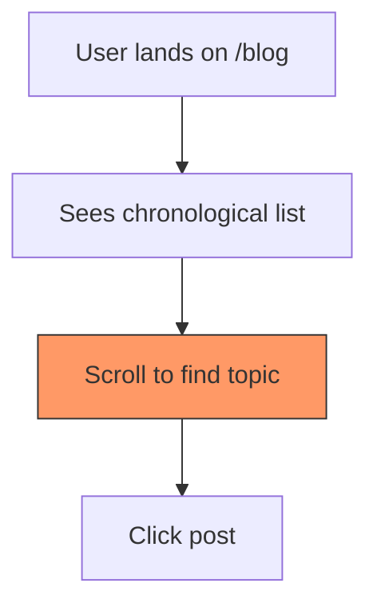
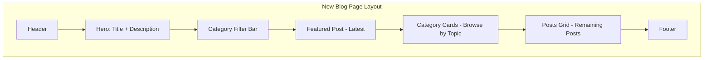
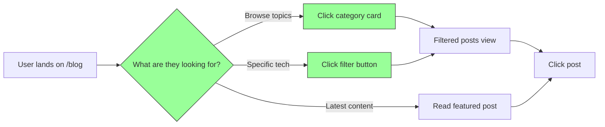

# UX Improvement Plan: Blog Index Page

## Overview
| Field | Value |
|-------|-------|
| Target | `/blog` index page (`src/pages/blog/index.astro`) |
| Date | 2026-01-09 |
| Domains | Heuristics + User Flow |
| Issues | 2 major, 4 minor |
| Constraint | Bootstrap 5 (no new deps) |

## Success Criteria
| Metric | Current | Target | Measurement |
|--------|---------|--------|-------------|
| Content Discovery | No categories | Category-based nav | User can filter by topic |
| Click Depth | 1 click to post | 2 paths: browse all OR by category | User flow analysis |
| Visual Hierarchy | Flat list | Categorized sections | Manual review |
| Heuristic Score | 5/10 | 8/10 | Nielsen checklist |

## Current State Analysis



### Problems Identified

1. **No Category Navigation** - Users can't filter by topic (Astro, Rust, React, etc.)
2. **Flat Chronological List** - No visual grouping by topic
3. **No Topic Discovery** - New visitors don't know what content exists
4. **Missing Post Count** - No indication of content volume per topic
5. **No Search/Filter** - Can't quickly find specific tech content
6. **Description Hidden** - Post descriptions not shown in listing

---

## P0: Critical Fixes (Do Now)

### [ ] 1. Add Icon Field to Categories Schema
**Domain**: Heuristics #2 (Match real world)

**Problem**: Categories need visual icons for better recognition

**Solution**: Add `icon` field to store Bootstrap Icons class name

**File**: `src/lib/schema.ts`

```typescript
// Categories table - blog post categories
export const categories = pgTable(
  "categories",
  {
    id: text("id").primaryKey(),
    name: text("name").notNull().unique(),
    slug: text("slug").notNull().unique(),
    description: text("description"),
    color: text("color"), // Hex color for UI badges
    icon: text("icon"),   // Bootstrap Icons class (e.g., "bi-code-slash")
    createdAt: timestamp("created_at").notNull().defaultNow(),
    updatedAt: timestamp("updated_at").notNull().defaultNow(),
  },
  (table) => [index("idx_categories_slug").on(table.slug)]
);
```

**Recommended Icons for Programming Topics**:

| Category | Icon Class | Preview |
|----------|------------|---------|
| All Posts | `bi-grid-3x3-gap` | Grid icon |
| Astro | `bi-rocket-takeoff` | Rocket |
| React | `bi-filetype-jsx` | JSX file |
| NextJS | `bi-arrow-right-circle` | Arrow |
| Rust | `bi-gear` | Gear |
| TypeScript | `bi-filetype-tsx` | TSX file |
| JavaScript | `bi-filetype-js` | JS file |
| Notes | `bi-journal-text` | Journal |
| Tutorial | `bi-mortarboard` | Graduation cap |
| Video Notes | `bi-play-circle` | Play button |
| Speaking | `bi-mic` | Microphone |

**Migration**: Run after schema update
```bash
pnpm drizzle-kit generate
pnpm drizzle-kit migrate
```

---

### [ ] 2. Add Category-Based Navigation with Icons
**Domain**: Heuristics #6 (Recognition > Recall) | User Flow

**Problem**: Users must scroll through all posts to find relevant content

**Solution**: Add category filter bar with Bootstrap Icons at top of blog page

**Files to modify**:
- `src/pages/blog/index.astro` - Main page
- `src/content.config.ts` - Add category to schema (opt)

**Implementation**:

```astro
---
// src/pages/blog/index.astro
import { getCollection } from 'astro:content';
import BaseHead from '../../components/BaseHead.astro';
import Footer from '../../components/Footer.astro';
import Header from '../../components/Header.astro';
import { SITE_DESCRIPTION, SITE_TITLE } from '../../consts';
import { db } from '../../lib/db';
import { categories } from '../../lib/schema';
import { asc } from 'drizzle-orm';

export const prerender = false;

// Fetch categories from DB
const allCategories = await db
  .select()
  .from(categories)
  .orderBy(asc(categories.name));

// Get filter from URL
const url = Astro.url;
const categoryFilter = url.searchParams.get('category');

const posts = (await getCollection('blog')).sort(
  (a, b) => b.data.pubDate.valueOf() - a.data.pubDate.valueOf(),
);
---

<!doctype html>
<html lang="en">
  <head>
    <BaseHead title={`Blog | ${SITE_TITLE}`} description={SITE_DESCRIPTION} />
  </head>
  <body>
    <Header />
    <main class="container py-4">
      <!-- Hero Section -->
      <section class="text-center mb-5">
        <h1 class="display-5 fw-bold">Blog</h1>
        <p class="lead text-muted">
          Programming notes, tutorials, and learnings about web development
        </p>
      </section>

      <!-- Category Filter with Icons -->
      <section class="mb-4">
        <div class="d-flex flex-wrap gap-2 justify-content-center">
          <a
            href="/blog"
            class:list={["btn d-inline-flex align-items-center gap-2", !categoryFilter ? "btn-primary" : "btn-outline-secondary"]}
          >
            <i class="bi bi-grid-3x3-gap"></i>
            All Posts
          </a>
          {allCategories.map((cat) => (
            <a
              href={`/blog?category=${cat.slug}`}
              class:list={[
                "btn d-inline-flex align-items-center gap-2",
                categoryFilter === cat.slug ? "btn-primary" : "btn-outline-secondary"
              ]}
              style={cat.color && categoryFilter !== cat.slug ? `color: ${cat.color}; border-color: ${cat.color};` : ''}
            >
              {cat.icon && <i class={`bi ${cat.icon}`}></i>}
              {cat.name}
            </a>
          ))}
        </div>
      </section>

      <!-- Posts Grid -->
      <section>
        <div class="row g-4">
          {posts.map((post, index) => (
            <div class={index === 0 ? "col-12" : "col-md-6"}>
              <article class="card h-100 border-0 shadow-sm">
                {post.data.heroImage && (
                  
                )}
                <div class="card-body">
                  <h2 class={index === 0 ? "h3" : "h5"}>
                    <a href={`/blog/${post.id}/`} class="text-decoration-none text-dark stretched-link">
                      {post.data.title}
                    </a>
                  </h2>
                  <p class="text-muted small mb-2">
                    <time datetime={post.data.pubDate.toISOString()}>
                      {post.data.pubDate.toLocaleDateString('en-US', {
                        year: 'numeric',
                        month: 'long',
                        day: 'numeric'
                      })}
                    </time>
                  </p>
                  <p class="card-text text-muted">
                    {post.data.description}
                  </p>
                </div>
              </article>
            </div>
          ))}
        </div>
      </section>
    </main>
    <Footer />
  </body>
</html>
```

**Verification**:
- [ ] Categories display from DB with icons
- [ ] Filter param works in URL
- [ ] Active state shows on selected category
- [ ] Icons render correctly from Bootstrap Icons

---

## P1: Major Improvements

### [ ] 1. Add Category Cards Section with Icons
**Domain**: Heuristics #2 (Match real world), User Flow

**Problem**: First-time visitors don't know what topics are covered

**Solution**: Add visual category cards with Bootstrap Icons showing topic overview

```astro
<!-- Category Discovery Section - Add before posts grid -->
<section class="mb-5">
  <h2 class="h4 mb-3">Browse by Topic</h2>
  <div class="row g-3">
    {allCategories.map((cat) => (
      <div class="col-6 col-md-4 col-lg-3">
        <a
          href={`/blog?category=${cat.slug}`}
          class="card h-100 text-decoration-none border-0 shadow-sm hover-lift"
          style={cat.color ? `border-left: 4px solid ${cat.color} !important;` : ''}
        >
          <div class="card-body d-flex flex-column align-items-center text-center p-3">
            {cat.icon && (
              <i
                class={`bi ${cat.icon} fs-1 mb-2`}
                style={cat.color ? `color: ${cat.color};` : ''}
              ></i>
            )}
            <h3 class="h6 mb-1">{cat.name}</h3>
            {cat.description && (
              <p class="text-muted small mb-0">{cat.description}</p>
            )}
          </div>
        </a>
      </div>
    ))}
  </div>
</section>

<style>
  .hover-lift {
    transition: transform 0.2s ease, box-shadow 0.2s ease;
  }
  .hover-lift:hover {
    transform: translateY(-4px);
    box-shadow: 0 0.5rem 1rem rgba(0, 0, 0, 0.15) !important;
  }
</style>
```

**Effort**: ~30min

### [ ] 2. Featured/Latest Post Hero
**Domain**: Heuristics #8 (Aesthetic & minimal)

**Problem**: First post gets lost in the grid

**Solution**: Highlight latest post as featured hero

```astro
<!-- Featured Post - First post gets special treatment -->
{posts.length > 0 && (
  <section class="mb-5">
    <article class="card border-0 bg-light">
      <div class="row g-0">
        {posts[0].data.heroImage && (
          <div class="col-md-6">
            
          </div>
        )}
        <div class={posts[0].data.heroImage ? "col-md-6" : "col-12"}>
          <div class="card-body p-4">
            <span class="badge bg-primary mb-2">Latest</span>
            <h2 class="card-title h3">
              <a href={`/blog/${posts[0].id}/`} class="text-decoration-none text-dark">
                {posts[0].data.title}
              </a>
            </h2>
            <p class="text-muted small">
              {posts[0].data.pubDate.toLocaleDateString('en-US', {
                year: 'numeric',
                month: 'long',
                day: 'numeric'
              })}
            </p>
            <p class="card-text">{posts[0].data.description}</p>
            <a href={`/blog/${posts[0].id}/`} class="btn btn-outline-primary">
              Read More
            </a>
          </div>
        </div>
      </div>
    </article>
  </section>
)}
```

**Effort**: ~20min

### [ ] 3. Add Category to Content Schema
**Domain**: User Flow

**Problem**: MDX posts don't have category metadata

**Solution**: Extend frontmatter schema for category/tags

**File**: `src/content.config.ts`

```typescript
const blog = defineCollection({
  loader: glob({ base: './src/content/blog', pattern: '**/*.{md,mdx}' }),
  schema: ({ image }) =>
    z.object({
      title: z.string(),
      description: z.string(),
      pubDate: z.coerce.date(),
      updatedDate: z.coerce.date().optional(),
      heroImage: image().optional(),
      // New fields
      category: z.string().optional(), // matches category slug
      tags: z.array(z.string()).optional(),
    }),
});
```

**Effort**: ~10min

---

## P2: Quick Wins

| # | Issue | Domain | File | Fix | Effort |
|---|-------|--------|------|-----|--------|
| [ ] | Missing page title | Heuristics | index.astro | Add `<h1>Blog</h1>` | 5min |
| [ ] | No empty state | User Flow | index.astro | Add "No posts yet" msg | 5min |
| [ ] | Missing descriptions | Heuristics | index.astro | Show `post.data.description` | 10min |
| [ ] | Poor mobile spacing | Responsive | index.astro | Use Bootstrap `container` | 5min |

---

## P3: Backlog

| Issue | Domain | Notes |
|-------|--------|-------|
| Search functionality | User Flow | Consider Pagefind for static search |
| Tag cloud | User Flow | Show popular tags |
| Reading time | Heuristics | Calculate from content length |
| Related posts | User Flow | Show similar content |

---

## Recommended Page Structure



## User Flow: After Improvements



---

## Implementation Order

1. **Phase 1** (Core): Category filter bar + Bootstrap layout refactor
2. **Phase 2** (Discovery): Category cards section + featured post
3. **Phase 3** (Content): Update content schema + migrate posts

---

## Files to Modify

| File | Changes |
|------|---------|
| `src/lib/schema.ts` | Add `icon` field to categories table |
| `src/pages/blog/index.astro` | Complete rewrite w/ Bootstrap + Icons |
| `src/content.config.ts` | Add category/tags to schema |
| Existing `.md`/`.mdx` posts | Add category frontmatter |

## DB Migration Steps

After adding `icon` field to schema:
```bash
pnpm drizzle-kit generate   # Generate migration
pnpm drizzle-kit migrate    # Apply to database
```

Then update existing categories via admin panel or SQL:
```sql
UPDATE categories SET icon = 'bi-rocket-takeoff' WHERE slug = 'astro';
UPDATE categories SET icon = 'bi-filetype-jsx' WHERE slug = 'react';
UPDATE categories SET icon = 'bi-gear' WHERE slug = 'rust';
UPDATE categories SET icon = 'bi-journal-text' WHERE slug = 'notes';
```

---

## Notes

- Uses existing DB categories from `src/lib/schema.ts`
- Leverages Bootstrap 5 classes (no new CSS needed)
- Category colors from DB can style buttons/badges
- URL params for filtering maintains SEO-friendly structure
